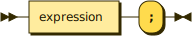
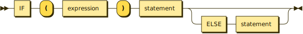

**program:**

**declarations:**

referenced by:

* block
* program

**declaration:**

referenced by:

* declarations

**classDecl:**

referenced by:

* declaration

**opt_inheritance:**

referenced by:

* classDecl

**varDecl:**

referenced by:

* declaration
* opt_varOrExprStmt

**opt_assignment:**

referenced by:

* varDecl

**funDecl:**

referenced by:

* declaration

**function:**

referenced by:

* classDecl
* funDecl

**opt_parameters:**

referenced by:

* function

**statement:**

referenced by:

* declaration
* forStmt
* ifStmt
* opt_else
* whileStmt

**exprStmt:**

referenced by:

* opt_varOrExprStmt
* statement

**forStmt:**

referenced by:

* statement

**opt_varOrExprStmt:**

referenced by:

* forStmt

**opt_expression:**

referenced by:

* forStmt
* returnStmt

**ifStmt:**

referenced by:

* statement

**opt_else:**

referenced by:

* ifStmt

**printStmt:**

referenced by:

* statement

**returnStmt:**

referenced by:

* statement

**whileStmt:**

referenced by:

* statement

**block:**

referenced by:

* function
* statement

**expression:**

referenced by:

* exprStmt
* ifStmt
* opt_arguments
* opt_assignment
* opt_expression
* primary
* printStmt
* whileStmt

**opt_callDot:**

referenced by:

* expression

**logic_and:**

referenced by:

* expression

**equality:**

referenced by:

* logic_and

**comparison:**

referenced by:

* equality

**term:**

referenced by:

* comparison

**factor:**

referenced by:

* term

**unary:**

referenced by:

* factor

**call:**

referenced by:

* opt_callDot
* unary

**opt_arguments:**

referenced by:

* call

**primary:**

referenced by:

* call

## 
 generated by [RR - Railroad Diagram Generator][RR]

[RR]: http://bottlecaps.de/rr/ui